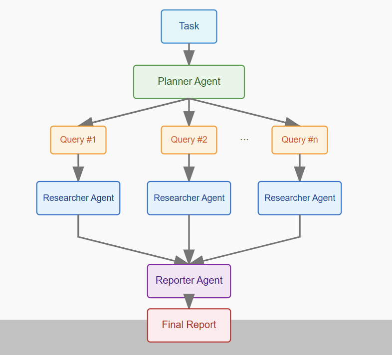

# Multi-Agent Web Research System

This project implements a multi-agent system designed to perform web research based on a user's query and generate a synthesized report. It leverages multiple AI agents, external APIs, and asynchronous processing to achieve this.

## System Overview

  
*Caption: Overview of the multi-agent research process*

### Process Steps

1. **User Query**: The process starts with the main research task provided by the user.
2. **Planning Agent**: This agent takes the task, analyzes it (understanding intent, constraints like dates), and breaks it down into several specific Sub-Queries.
3. **Concurrent Research Loop**: This is the core workhorse. For each Sub-Query generated by the planner:
   - **Search**: Tavily is used to find relevant web page URLs for that specific Sub-Query.
   - **Scrape**: Firecrawl (with rate limiting) attempts to retrieve the content from those URLs as clean Markdown. If scraping fails (due to website blocks, rate limits, errors), an Error Note is generated instead.
   - **Summarize**: The successful Markdown (or an error note) is passed to the Researcher LLM. This LLM generates a concise Focused Summary based only on information relevant to the original task or passes along the error note.
4. **Findings Block**: The output for each Sub-Query is a self-contained block containing either the relevant summaries or notes about errors encountered for that sub-topic.
5. **Aggregate Findings**: All the individual "Findings Blocks" from the concurrent research loops are collected together.
6. **Reporting Agent**: This agent takes the complete set of aggregated findings and the original user task. It uses a powerful Reporter LLM to:
   - Synthesize: Combine information logically.
   - Structure: Organize the content into a coherent report.
   - Address Task: Ensure the report directly answers the original query.
   - Handle Errors: Acknowledge sources where information couldn't be retrieved.
   - Generate: Produce the final text.
7. **Final Report / Error**: The system outputs the complete, synthesized report or a final error message if the reporting stage itself failed.

## Core Capabilities

- **Query Analysis**: Understands user query intent and decomposes complex questions.
- **Web Search**: Uses Tavily API to find relevant URLs for sub-queries.
- **Content Extraction**: Employs Firecrawl API for robust scraping of web content, returning Markdown.
- **Information Summarization**: Uses an LLM via OpenRouter to summarize scraped content, focusing on relevance.
- **Concurrent Processing**: Researches multiple sub-queries in parallel for efficiency.
- **Information Synthesis**: Combines findings from all sub-queries.
- **Report Generation**: Uses a powerful LLM via OpenRouter to create a structured, coherent report.
- **Error Handling**: Manages issues like API errors, rate limits, scraping failures, and LLM response problems.

## Technology Stack

- **Python 3.9+** (with asyncio)
- **LLM Interaction**: OpenRouter API (via `openai` library)
- **Web Search**: Tavily API (`tavily-python`)
- **Web Scraping**: Firecrawl API (`firecrawl-py`)
- **Configuration**: `python-dotenv`, `pydantic-settings`
- **Dependencies**: `json_repair`, `logging`

## Setup Instructions

1. **Clone the Repository**:
   ```bash
   git clone https://github.com/KrishO9/WebResearchAgent.git
   cd WebResearchAgent
   ```

2. **Create Virtual Environment (Recommended)**:
   ```bash
   python -m venv .venv
   # Activate:
   # Windows: .\.venv\Scripts\activate
   # MacOS/Linux: source .venv/bin/activate
   ```

3. **Install Dependencies**:
   ```bash
   pip install -r requirements.txt
   ```
   Ensure `requirements.txt` includes all packages listed in the Technology Stack section.

4. **Configure API Keys**:
   - Create a file named `.env` in the root project directory (`web-research-agent/`).
   - Add your API keys and optional settings:
     ```dotenv
     # --- Required ---
     OPENROUTER_API_KEY="sk-or-v1-..."  # Your OpenRouter API Key
     TAVILY_API_KEY="tvly-..."         # Your Tavily Search API Key
     FIRECRAWL_API_KEY="fc-..."        # Your Firecrawl API Key

     # --- Optional - Recommended for OpenRouter ---
     YOUR_SITE_URL="http://localhost:8000"  # Or your app identifier
     YOUR_APP_NAME="MyResearchAgent"        # Or your app name

     # --- Optional - LLM Models (Use OpenRouter model identifiers) ---
     # OPENROUTER_MODEL_PLANNER="openai/gpt-4o"
     # OPENROUTER_MODEL_RESEARCHER="openai/gpt-3.5-turbo"
     # OPENROUTER_MODEL_REPORTER="openai/gpt-4o"

     # --- Optional - Other Settings ---
     # MAX_SUB_QUERIES=5
     # MAX_SEARCH_RESULTS_PER_QUERY=5
     # MAX_SCRAPE_CONCURRENCY=2  # Keep low for free tiers initially
     ```
   - **IMPORTANT**: Add `.env` to your `.gitignore` file to prevent committing secrets.

## Running the Agent

Execute the main script from the command line within the project's root directory (`web-research-agent/`), providing the research query as an argument:

```bash
python main.py "Your research query goes here"
```

### Examples:
```bash
python main.py "What are the latest advancements in solid-state battery technology?"
python main.py "Compare the economic impacts of tourism in Italy vs Spain."
python main.py "How does climate change affect coffee production?"
```

The agent will log its progress (Planning, Researching, Reporting) to the console and print the generated report.

## Example Output

Below is an example report generated by the system, taken from `results/result2.md`:

Original Task: How to treat dementia

----------------------------------------------------------------------

# **Comprehensive Report on Treating Dementia**

## **Introduction**
This report synthesizes available research findings on the treatment of dementia, including medical interventions, non-pharmacological approaches, the impact of early diagnosis, caregiver roles, and emerging experimental treatments. Due to technical limitations (inaccessible sources), some details could not be retrieved, but the report outlines key themes based on the available data.

## **Current Medical Treatments for Dementia**
While specific medication details from the provided sources could not be extracted, general dementia treatments typically include:
- **Cholinesterase inhibitors** (e.g., donepezil, rivastigmine) to manage cognitive symptoms.
- **NMDA receptor antagonists** (e.g., memantine) to regulate glutamate activity.
- **Combination therapies** for moderate to severe cases.

Research indicates ongoing developments in Alzheimer’s drugs and treatments targeting broader disease factors beyond amyloid plaques (as suggested by NIA/NIH sources). However, efficacy varies, and no cure exists.

## **Non-Pharmacological Interventions**
Though specific studies from the sources were inaccessible, evidence-based non-drug approaches commonly recommended include:
- **Cognitive stimulation therapy** to maintain mental engagement.
- **Physical exercise** to slow cognitive decline.
- **Dietary adjustments** (e.g., Mediterranean diet) to support brain health.
- **Social engagement and structured routines** to reduce agitation.

## **Impact of Early Diagnosis on Treatment**
Early detection is critical for:
- **Slowing progression** through timely medication and lifestyle changes.
- **Better symptom management** by addressing issues before severe decline.
- **Access to clinical trials** for experimental treatments.

However, details from the cited studies (e.g., Psychology Today, Mayo Clinic) could not be retrieved.

## **Role of Caregivers and Support Systems**
Caregivers are essential in dementia management, providing:
- **Daily assistance** with activities of living.
- **Emotional support** to mitigate behavioral symptoms.
- **Medical coordination** (e.g., ensuring medication adherence).

Support resources (e.g., respite care, training programs) are often available, though specifics from Harvard Magazine and JAMA sources were not accessible.

## **Latest Research and Experimental Treatments**
Emerging areas of research (per NIA/NIH and Nature references) may include:
- **Targeting non-amyloid pathways** (e.g., tau proteins, neuroinflammation).
- **Gene therapies and immunotherapies** in clinical trials.
- **Preventive strategies** focusing on vascular and metabolic health.

## **Conclusion**
Dementia treatment involves a multidisciplinary approach, blending medications, lifestyle modifications, early intervention, and caregiver support. While current therapies focus on symptom management, ongoing research aims to develop disease-modifying treatments. Due to source accessibility issues, further investigation is needed for detailed efficacy data and emerging innovations.

#### **Note:** This report is based on the provided findings; unavailable source content limited some sections. For comprehensive guidance, consulting healthcare professionals and updated clinical guidelines is recommended.
======================================================================


For additional examples, see the complete results directory in the repository.
